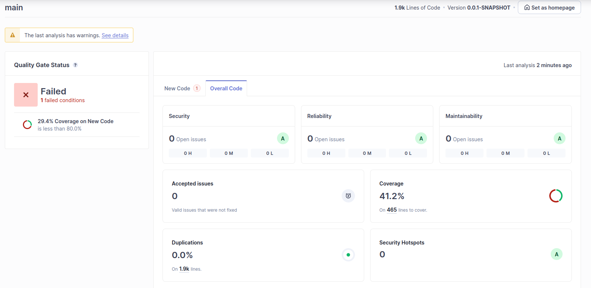
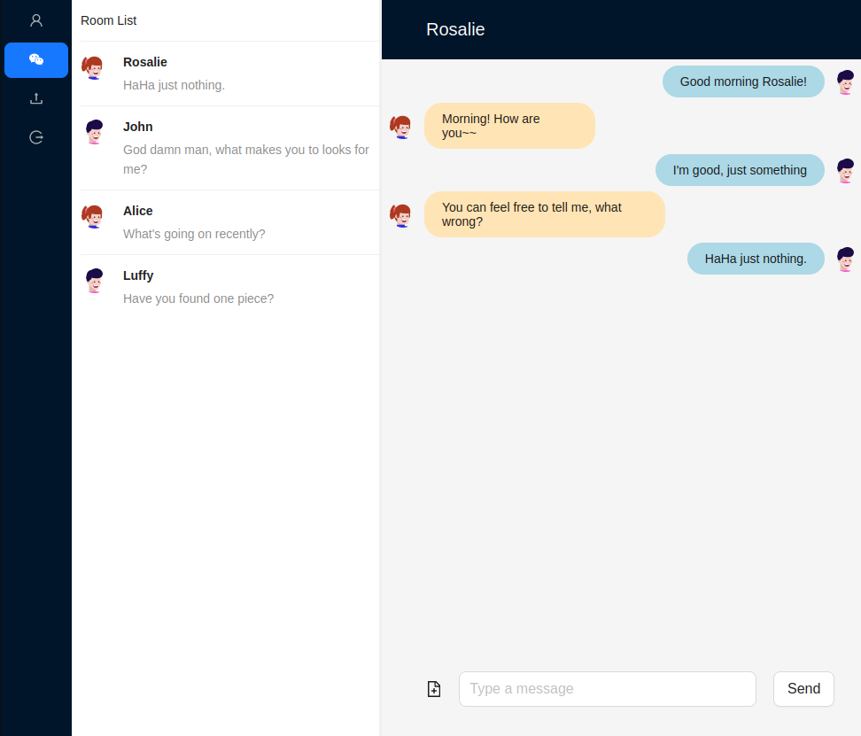

# ChatApp

## What is this?
> This is an exercise-based project  
I mainly used this project to become familiar with Spring-boot development technology and ORM database access technology. In addition, unit testing, github actions and static analysis of program code are also included in the scope of practice of this project.


## Directory Structure
```
+-- pom.xml
+-- /src
    +-- /main
        +-- /app  /react-ts code in here
        +-- /java
        +-- /resources
    +-- /test
+-- /target
```

## Currently Code Quality
* The test for frontend hasn't performed, so the coverage is low.


## Screen Displayed


## Future Works
The future works may contains below functions or skills but uncertainly:
* use langchain to do a chat ai in a chatroom
* frontend unit tests
* use OpenTelemetry to get the telemetry of this app
* use Jenkins to run CI
* add security analysis into the CI pipeline
* and so on

## Skills
---
#### Frontend
* React-ts
* Redux-Toolkit
* Antd

#### Backend
* spring-boot
* spring-message
* spring-data-jpa

#### Database
* H2 database

#### Test
* JUnit
* Mockito

#### Code Quality & Analysis
* SonarQube

#### CI/CD
* github action
